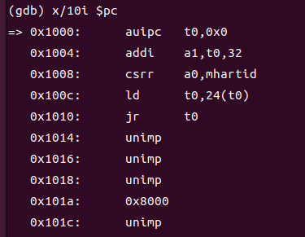
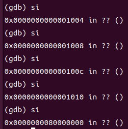
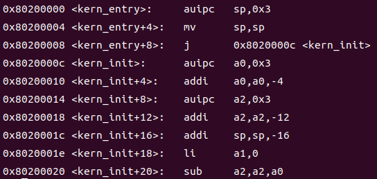
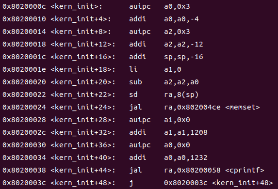
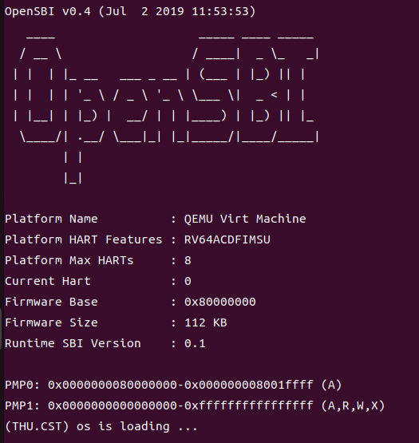
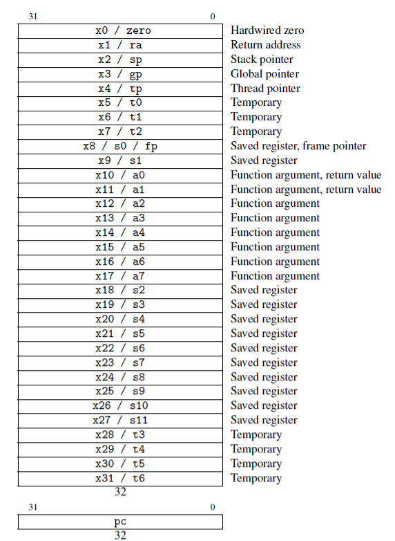
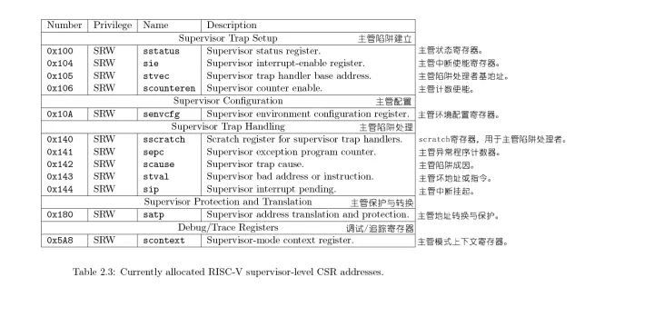

# lab0&1 实验报告

# 操作系统 Lab0.5 实验报告

---

## 练习 1: 使用 GDB 验证启动流程

为了熟悉使用 qemu 和 gdb 进行调试工作, 使用 gdb 调试 QEMU 模拟的 RISC-V 计算机加电开始运行到执行应用程序的第一条指令（即跳转到 0x80200000）这个阶段的执行过程，说明 RISC-V 硬件加电后的几条指令在哪里？完成了哪些功能？要求在报告中简要写出练习过程和回答。

Qemu 模拟 RISC-V 硬件从上电到加载 bootloader 的过程：

PC 被赋值 0x1000，即复位地址，CPU 到复位地址执行复位程序：

```assembly
=> 0x1000:      auipc   t0,0x0     //t0=pc
   0x1004:      addi    a1,t0,32
   0x1008:      csrr    a0,mhartid
   0x100c:      ld      t0,24(t0) //t0=内存中取出来的数，为0x80000000
   0x1010:      jr      t0        //跳转到bootloader的地址
```

复位程序指定跳转到 0x80000000，即 bootloader 被加载的地址。
进而执行 bootloader，来引导操作系统。

---

### 通过代码分析

##### 1.复位地址设定为 0x1000

在 qemu-4.1.1/target/riscv/cpu.c 中，有代码：

```c
static void riscv_any_cpu_init(Object *obj)
{
    CPURISCVState *env = &RISCV_CPU(obj)->env;
    set_misa(env, RVXLEN | RVI | RVM | RVA | RVF | RVD | RVC | RVU);
    set_priv_version(env, PRIV_VERSION_1_11_0);
    set_resetvec(env, DEFAULT_RSTVEC);
}
```

其中 set_resetvec(env, DEFAULT_RSTVEC); 将 resetvec 设置为宏 DEFAULT_RSTVEC

在 qemu-4.1.1/target/riscv/cpu_bits.h 中，定义：

```c
/* Default Reset Vector adress */
#define DEFAULT_RSTVEC      0x1000
```

将其设置为 0x1000

在 cpu.c 中，又有：

```c
static void riscv_cpu_reset(CPUState *cs)
{
    RISCVCPU *cpu = RISCV_CPU(cs);
    RISCVCPUClass *mcc = RISCV_CPU_GET_CLASS(cpu);
    CPURISCVState *env = &cpu->env;

    mcc->parent_reset(cs);
#ifndef CONFIG_USER_ONLY
    env->priv = PRV_M;
    env->mstatus &= ~(MSTATUS_MIE | MSTATUS_MPRV);
    env->mcause = 0;
    env->pc = env->resetvec;
#endif
    cs->exception_index = EXCP_NONE;
    env->load_res = -1;
    set_default_nan_mode(1, &env->fp_status);
}
```

其中 env->pc = env->resetvec; 将 resetvec 赋值给 pc，则复位地址就设置为 0x1000

说明 CPU 从 0x1000 处开始执行复位代码。

---

##### 2.bootloader

初始化 RISC-V 虚拟开发板时：
qemu-4.1.1/hw/riscv/virt.c：

```c
rom_add_blob_fixed_as("mrom.reset", reset_vec, sizeof(reset_vec),
                      memmap[VIRT_MROM].base, &address_space_memory);
```

将复位代码加载到指定位置（`memmap[VIRT_MROM].base` ，即复位地址上）

同时，还将一个 bootloader 加载到 0x80000000 的位置上：

```c
riscv_find_and_load_firmware(machine, BIOS_FILENAME,
                             memmap[VIRT_DRAM].base);
//memmap[VIRT_DRAM].base=0x80000000
```

---

### Qemu 模拟 RISC-V 处理器：

他有一个内置的 ROM，用来存放复位代码。
当 CPU 上电的时候，pc 被赋值为复位地址（0x1000），CPU 进而执行复位代码。
在复位代码中，又指定跳转到 0x80000000 处，开始执行 bootloader。
这就是上电到加载 bootloader 的大概过程。

---

### 具体调试过程

先查看即将执行的 10 条汇编指令，代码从 0x1000 开始，说明此处为加电后的复位地址

> x/10i $pc



继续运行，连续运行五次后，发现代码跳转到 0x80000000



由上图，复位程序成功指定跳转到 0x80000000，即 bootloader 被加载的地址

可分析得出从 0x1000 到 0x1014 即为硬件加电后的几条指令，执行完这几条指令后在 0x80000000 这个位置向硬件中加载 bootloader

此时我们在 0x80200000 处打一个断点

> b *0x80200000
> c

成功运行到 0x80200000 处后，我们来查看他的汇编代码



可以看到，程序已经进入了 entry.s（也就是到达了整个内核的入口点，虽然是虚假的），并在其中分配好内核栈，然后跳转到 kern_init（真实的入口点）初始化函数代码部分。

我们继续运行，查看 kern_init 的汇编代码



从此处 0x8020003C 代码行可以看出，程序进入了一个死循环，并调用了 cprint 函数以回应我们的运行过程。

继续运行

> continue

查看 debug 界面有 os is loading 的输出，进入死循环，说明已经成功跑起来了。



## 额外知识点

列出你认为 OS 原理中很重要，但在实验中没有对应上的知识点

1、重要知识点：

qemu 环境的搭建，对 qemu 命令的理解和掌握，对 gdb 调试要有一定的掌握，对汇编知识的掌握，以及了解 ucore 编程方法和通用数据结构。实验整体做起来非常难，大多数知识点以前只是略有涉及，没有实际结果代码使用过，以及也有许多知识点没有学过，需要从网上搜索学习理解。

2、对应的 OS 知识点：

感觉在实验中使用最多的知识点就是地址空间和地址转换，无论是 gdb 调试还是汇编语言的书写和阅读，都离开地址空间和地址跳转，地址重定位。

3、需要拓展的知识点：

函数栈的构建过程

熟悉 Linux 的各种指令也会对实验有很大的帮助。

# Lab1 实验报告

---

### 练习 1：理解内核启动中的程序入口操作

阅读 kern/init/entry.S 内容代码，结合操作系统内核启动流程，说明指令 la sp, bootstacktop 完成了什么操作，目的是什么？tail kern_init 完成了什么操作，目的是什么？

#### `la sp, bootstacktop`：

这个指令使用伪指令 `la（load address）` 将 `bootstacktop` 的地址加载到栈指针寄存器 `sp` 中。`bootstacktop` 是一个全局标志符，它的值通常指向内核的堆栈顶部（即内核栈的顶部），在本实验中正是 entry.S 的最后一行。通过将 `sp` 设置为 `bootstacktop` 的地址，内核将栈指针初始化为内核堆栈的顶部，以便内核代码可以在内核堆栈上运行。

#### `tail kern_init`：

这个指令使用伪指令 `tail` 跳转到 `kern_init` 函数。`tail` 跳转是一种特殊的跳转，它不会在调用栈上创建新的函数调用帧，而是直接跳转到目标函数。
`kern_init` 函数是定义在 `init.c` 中的内核初始化函数。`tail` 跳转执行后，内核将开始执行 `kern_init`，从而启动操作系统的初始化。

#### 作用

这段汇编代码的目的是将栈指针初始化为内核堆栈的顶部，并跳转到内核初始化函数 kern_init，从而启动操作系统内核。

---

### 练习 2：完善中断处理（需要编程）

请编程完善 trap.c 中的中断处理函数 trap，在对时钟中断进行处理的部分填写 kern/trap/trap.c 函数中处理时钟中断的部分，使操作系统每遇到 100 次时钟中断后，调用 print_ticks 子程序，向屏幕上打印一行文字”100ticks”，在打印完 10 行后调用 sbi.h 中的 shut_down() 函数关机。
要求完成问题 1 提出的相关函数实现，提交改进后的源代码包（可以编译执行），并在实验报告中简要说明实现过程和定时器中断中断处理的流程。实现要求的部分代码后，运行整个系统，大约每 1 秒会输出一次”100 ticks”，输出 10 行。

代码补充如下：

```c
void interrupt_handler(struct trapframe *tf)
{
    // cprintf("trap.c---interrupt_handler\n");
    intptr_t cause = (tf->cause << 1) >> 1; //去除异常位
    switch (cause)
    {
    case IRQ_U_SOFT:
        cprintf("User software interrupt\n");
        break;
    case IRQ_S_SOFT:
        cprintf("Supervisor software interrupt\n");
        break;
    case IRQ_H_SOFT:
        cprintf("Hypervisor software interrupt\n");
        break;
    case IRQ_M_SOFT:
        cprintf("Machine software interrupt\n");
        break;
    case IRQ_U_TIMER:
        cprintf("User software interrupt\n");
        break;
    case IRQ_S_TIMER:
        // "All bits besides SSIP and USIP in the sip register are
        // read-only." -- privileged spec1.9.1, 4.1.4, p59
        // In fact, Call sbi_set_timer will clear STIP, or you can clear it
        // directly.
        // cprintf("Supervisor timer interrupt\n");
        /* LAB1 EXERCISE2   YOUR CODE : 2112426 */
        /*(1)设置下次时钟中断- clock_set_next_event()
        *(2)计数器（ticks）加一
        *(3)当计数器加到100的时候，我们会输出一个`100ticks`表示我们触发了100次时钟中断，同时打印次数（num）加一
        * (4)判断打印次数，当打印次数为10时，调用<sbi.h>中的关机函数关机
        */
        clock_set_next_event();
        ticks++;
        if(ticks%TICK_NUM==0)
        {
            num++;
            print_ticks();
        }
        if(num>=10)
        {
            num=0;
            sbi_shutdown();
        }
        break;
    case IRQ_H_TIMER:
        cprintf("Hypervisor software interrupt\n");
        break;
    case IRQ_M_TIMER:
        cprintf("Machine software interrupt\n");
        break;
    case IRQ_U_EXT:
        cprintf("User software interrupt\n");
        break;
    case IRQ_S_EXT:
        cprintf("Supervisor external interrupt\n");
        break;
    case IRQ_H_EXT:
        cprintf("Hypervisor software interrupt\n");
        break;
    case IRQ_M_EXT:
        cprintf("Machine software interrupt\n");
        break;
    default:
        print_trapframe(tf);
        break;
    }
}
```

---

### 扩展练习 Challenge1：描述与理解中断流程

回答：描述 ucore 中处理中断异常的流程（从异常的产生开始），其中 mov a0，sp 的目的是什么？SAVE_ALL 中寄寄存器保存在栈中的位置是什么确定的？对于任何中断，__alltraps 中都需要保存所有寄存器吗？请说明理由。

#### 描述 ucore 中处理中断异常的流程（从异常的产生开始）

`stvec`:在中断产生后，应该有个中断处理程序来处理中断。CPU 怎么知道中断处理程序在哪？实际上，RISCV 架构有个 CSR 叫做 `stvec(Supervisor Trap Vector Base Address Register)`，即所谓的”中断向量表基址”。中断向量表的作用就是把不同种类的中断映射到对应的中断处理程序。如果只有一个中断处理程序，那么可以让 `stvec` 直接指向那个中断处理程序的地址。

在发生中断的时候, CPU 会跳到 stvec. 本次实验采用 Direct 模式, 即只有一个中断处理程序, stvec 直接跳到中断处理程序的入口点, 那么需要我们对 stvec 寄存器做初始化.

初始化代码在 `kern/trap/trap.c` 中，：

```c
void idt_init(void)
{
    extern void __alltraps(void);
    /* Set sscratch register to 0, indicating to exception vector that we are
    * presently executing in the kernel */
    write_csr(sscratch, 0);
    /* Set the exception vector address */
    write_csr(stvec, &__alltraps);
}
```

其中 `write_csr(stvec, &__alltraps);` 表示，将 stvec 的值设置为 `kern/trap/trapentry.S` 中的全局标签 `__alltraps`，也就是 trap 的入口处。

中断的处理需要“放下当前的事情但之后还能回来接着之前往下做”，对于 CPU 来说，实际上只需要把原先的寄存器保存下来，做完其他事情把寄存器恢复回来就可以了。这些寄存器也被叫做 CPU 的 context(上下
文，情境)。我们要用汇编实现上下文切换 (context switch) 机制，这包含两步：

```
• 保存 CPU 的寄存器（上下文）到内存中（栈上）
• 从内存中（栈上）恢复 CPU 的寄存器
```

这两步也就对应着 SAVE_ALL 和 RESTORE_ALL。
为了方便我们组织上下文的数据（几十个寄存器），我们定义一个结构体，也就有了 trapframe。

那么我们从异常的产生开始分析处理中断异常的流程：

```
异常产生时，CPU跳转到 stvec，即 kern/trap/trapentry.S 的 __alltraps 标记 -> 
通过SAVE_ALL保存当前执行流的上下文，并通过函数调用，切换为 kern/trap/trap.c 的中断处理函数 trap() 的上下文，进入 trap() 的执行流。切换前的上下文作为一个结构体(实际传递的时栈顶指针，也即trapframe的起始地址)，传递给 trap() 作为函数参数 ->
kern/trap/trap.c 按照中断类型进行分发 (trap_dispatch(),interrupt_handler()或exception_handler())->
执行中断对应的处理语句-> 
完成处理，返回到 kern/trap/trapentry.S-> 
恢复原先的上下文，中断处理结束。
```

#### `mov a0, sp`

将栈指针 sp 的值保存到通用寄存器 a0 中，这将作为参数传递给 trap 函数。由于在 SAVE_ALL 中，寄存器保存是以 sp 为起始地址的，当后续跳转到 trap 函数，会读取把 sp 作为 trapframe 的指针，读取一个 trapframe，也即先前 SAVE_ALL 保存的所有寄存器的值。

#### SAVE_ALL 中寄存器保存在栈中的位置是什么确定的？

根据 SAVE_ALL 代码可见，首先将栈顶抬高一个 trapframe 的大小，然后根据相对于栈顶的偏移量(n*REGBYTES,REGBYTES 是事先定义好的值，表示寄存器的大小)将寄存器一个个存储在栈中：

```
#宏定义 SAVE_ALL
.macro SAVE_ALL

csrw sscratch, sp  #保存原先的栈顶指针到sscratch

addi sp, sp, -36 * REGBYTES
#抬高栈顶：让栈项指针向低地址空间延伸36个寄存器的空间，可以放下一个trapFrame结构体。
#保存寄存器：除了32个通用寄存器，我们还要保存4个和中断有关的CSR(Control and Status Register，控制和状态寄存器)
#依次保存32个通用寄存器。但栈顶指针需要特殊处理。
#因为我们想在trapFrame里保存分配36个REGBYTES之前的sp
#也就是保存之前写到sscratch里的sp的值

# save x registers
STORE x0, 0*REGBYTES(sp)
STORE x1, 1*REGBYTES(sp)
STORE x3, 3*REGBYTES(sp)
STORE x4, 4*REGBYTES(sp)
STORE x5, 5*REGBYTES(sp)
STORE x6, 6*REGBYTES(sp)
STORE x7, 7*REGBYTES(sp)
STORE x8, 8*REGBYTES(sp)
STORE x9, 9*REGBYTES(sp)
STORE x10, 10*REGBYTES(sp)
STORE x11, 11*REGBYTES(sp)
STORE x12, 12*REGBYTES(sp)
STORE x13, 13*REGBYTES(sp)
STORE x14, 14*REGBYTES(sp)
STORE x15, 15*REGBYTES(sp)
STORE x16, 16*REGBYTES(sp)
STORE x17, 17*REGBYTES(sp)
STORE x18, 18*REGBYTES(sp)
STORE x19, 19*REGBYTES(sp)
STORE x20, 20*REGBYTES(sp)
STORE x21, 21*REGBYTES(sp)
STORE x22, 22*REGBYTES(sp)
STORE x23, 23*REGBYTES(sp)
STORE x24, 24*REGBYTES(sp)
STORE x25, 25*REGBYTES(sp)
STORE x26, 26*REGBYTES(sp)
STORE x27, 27*REGBYTES(sp)
STORE x28, 28*REGBYTES(sp)
STORE x29, 29*REGBYTES(sp)
STORE x30, 30*REGBYTES(sp)
STORE x31, 31*REGBYTES(sp)

# RISCV不能直接从CSR写到内存，需要csrr把CSR读取到通用寄存器，再从通用寄存器STORE到内存中。
csrrw s0, sscratch, x0
csrr s1, sstatus
csrr s2, sepc
csrr s3, sbadaddr
csrr s4, scause

STORE s0, 2*REGBYTES(sp)
STORE s1, 32*REGBYTES(sp)
STORE s2, 33*REGBYTES(sp)
STORE s3, 34*REGBYTES(sp)
STORE s4, 35*REGBYTES(sp)
# 结束SAVE_ALL宏定义
.endm
```

从另一个角度看，寄存器保存在栈中的位置实际上是根据寄存器的编号来确定的。

所有的普通寄存器的编号都对应着(num)*REGBYTES(sp)中的 num，即使是 STORE s0, 2*REGBYTES(sp)，s0 中存放的值也是最初在 sp 也就是 x2 中的值。

对于 csr 则是由必要的 csr 的相对编号大小决定的位置。sbadaddr 是个例外。





#### 对于任何中断，__alltraps 中都需要保存所有寄存器吗？请说明理由。

是否在 __alltraps 中需要保存所有寄存器取决于异常处理程序 trap 的需求以及处理不同类型的异常的方式。一般来说，保存所有寄存器状态是一种保守的做法，因为它可以确保在异常处理期间不会丢失任何关键信息。这对于处理异常时的稳定性和可靠性非常重要。

然而，有些异常处理程序可能只需要恢复特定的寄存器状态，而不需要保存和恢复所有寄存器。这取决于异常处理程序的设计和需求。如果某个特定的异常处理程序不需要保存和恢复所有寄存器，那么可以根据需要修改 SAVE_ALL 和 RESTORE_ALL 宏，仅保存和恢复必要的寄存器。

还有一些特殊的寄存器，例如 x0、gp(x3)、tp(x4)并不需要保存，因为它们并不会被更改。即使有很多寄存器并不需要在函数调用时被保存，但是进入__alltraps 的时的情况并不确定，因此不确定是否要保存。

总之，是否需要保存所有寄存器取决于异常处理程序的需求，以及你希望在异常处理期间保留多少上下文信息。保存所有寄存器可以确保稳定性，但也会增加一些开销。在设计异常处理程序时，需要权衡这些因素，并根据实际需求来确定保存哪些寄存器。

---

### 扩增练习 Challenge2：理解上下文切换机制

回答：在 trapentry.S 中汇编代码 `csrw sscratch, sp`；`csrrw s0, sscratch, x0` 实现了什么操作，目的是什么？SAVE_ALL 里面保存了 stval scause 这些 csr，而在 RESTORE_ALL 里面却不还原它们？那这样 store 的意义何在呢？

#### `csrw sscratch, sp`:

这条指令是将 sp 寄存器的值写入 sscratch 寄存器中，sscratch 是一个特权级寄存器，用来保存 supervisor 模式下的栈指针。这样做的目的是为了在发生异常或中断时，能够快速切换到 supervisor 模式下的栈空间

#### `csrrw s0, sscratch, x0`:

csrrw s0, sscratch, x0 这条指令是将 sscratch 寄存器的值读出并写入 s0 寄存器中，同时将 x0 寄存器的值（即 0）写入 sscratch 寄存器中。这样做的目的是为了将 supervisor 模式下的栈指针保存到一个通用寄存器中，以便后续使用

#### SAVE_ALL 里面保存了 stval、scause 这些 csr，而在 RESTORE_ALL 里面却不还原它们？那这样 store 的意义何在呢？

由代码可知：
SAVE_ALL 里面保存了这些寄存器：

```
通用寄存器：
x0-x31, 其中x2（sp）是先保存在sscratch，等s0(x8)存完后，在将其赋值到s0中，存储到2*REGBYTES(sp)。
存储的CSR:sstatus,sepc,sbadaddr,scause.
```

RESTORE_ALL 里面还原了这些寄存器：

```
x1-x31, 最后load x2（过程中sp会发生变化？）(x0是恒零寄存器,没必要还原)
```

我们发现，几个 CSR 都没有进行恢复，但既然保存了他们，就肯定有他们的意义，接下来我们仔细分析。

首先我们知道，除了 32 个通用寄存器之外，RISCV 架构还有大量的 `控制状态寄存器 Control and Status Registers(CSRs)`。其中有几个重要的寄存器和中断机制有关。

有些时候，禁止 CPU 产生中断很有用。（就像你在做重要的事情，如操作系统 lab 的时候，并不想被打断）。所以，`sstatus 寄存器 (Supervisor Status Register)` 里面有一个二进制位 `SIE(supervisor interrupt enable，在RISCV 标准里是 2^1 对应的二进制位)`，数值为 0 的时候，如果当程序在 S 态运行，将禁用全部中断。（对于在 U 态运行的程序，SIE 这个二进制位的数值没有任何意义），`sstatus` 还有一个二进制位 `UIE(user interrupt enable)` 可以在置零的时候禁止用户态程序产生中断。

在中断产生后，应该有个中断处理程序来处理中断。CPU 怎么知道中断处理程序在哪？实际上，RISCV 架
构有个 CSR 叫做 `stvec(Supervisor Trap Vector Base Address Register)`，即所谓的”中断向量表基址”。中断向量表的作用就是把不同种类的中断映射到对应的中断处理程序。如果只有一个中断处理程序，那么可以让 `stvec` 直接指向那个中断处理程序的地址。
对于 RISCV 架构，`stvec` 会把最低位的两个二进制位用来编码一个“模式”，如果是“00”就说明更高的 SXLEN-2 个二进制位存储的是唯一的中断处理程序的地址 (SXLEN 是 `stval` 寄存器的位数)，如果是“01”说明更高的 SXLEN-2 个二进制位存储的是中断向量表基址，通过不同的异常原因来索引中断向量表。但是怎样用 62 个二进制位编码一个 64 位的地址？RISCV 架构要求这个地址是四字节对齐的，总是在较高的 62 位后补两个 0。

`sepc(supervisor exception program counter)`:它会记录触发中断的那条指令的地址；
`scause`:它会记录中断发生的原因，还会记录该中断是不是一个外部中断；
`stval`:它会记录一些中断处理所需要的辅助信息，比如指令获取 (instruction fetch)、访存、缺页异常，它会把发生问题的目标地址或者出错的指令记录下来，这样我们在中断处理程序中就知道处理目标了。
`sbadaddr（Supervisor Bad Address）`：用于保存引发异常的指令或数据的地址。在某些异常情况下，需要知道引发异常的指令或数据的地址，以便进行错误处理。

这些 CSR 寄存器的值在异常处理过程中可能会发生变化，因此在恢复时不一定需要还原它们。一些 CSR 寄存器可能用于记录异常的原因或异常发生时的状态信息，这些信息可能在异常处理期间被修改或更新。因此，在具体的异常处理代码中，可能会有更详细的操作来处理这些 CSR 寄存器的值。

**store 它们的意义是为了给后续的中断处理函数传递足够的信息，方便进行中断处理**

---

### 扩展练习 Challenge3：完善异常中断

编程完善在触发一条非法指令异常 mret 和，在 kern/trap/trap.c 的异常处理函数中捕获，并对其进行处理，简单输出异常类型和异常指令触发地址，即“Illegal instruction caught at 0x(地址)”，“ebreak caught at 0x（地址）”与“Exception type:Illegal instruction”，“Exception type: breakpoint”。

#### 完善异常中断

在 `kern/trap/trap.c` 中，修改 `xception_handler` 函数，代码如下：

```
void exception_handler(struct trapframe *tf)
{
    // cprintf("trap.c---exception_handler\n");
    switch (tf->cause)
    {
    case CAUSE_MISALIGNED_FETCH:
        break;
    case CAUSE_FAULT_FETCH:
        break;
    case CAUSE_ILLEGAL_INSTRUCTION:
        // 非法指令异常处理
        /* LAB1 CHALLENGE3   YOUR CODE : 2112426  */
        /*(1)输出指令异常类型（ Illegal instruction）
        *(2)输出异常指令地址
        *(3)更新 tf->epc寄存器
        */
        cprintf("Exception type:Illegal instruction\n");
        cprintf("Illegal instruction caught at 0x%016llx\n", tf->epc);
        tf->epc += 2;
        break;
    case CAUSE_BREAKPOINT:
        // 断点异常处理
        /* LAB1 CHALLLENGE3   YOUR CODE : 2112426  */
        /*(1)输出指令异常类型（ breakpoint）
        *(2)输出异常指令地址
        *(3)更新 tf->epc寄存器
        */
        cprintf("Exception type: breakpoint\n");
        cprintf("ebreak caught at 0x%016llx\n", tf->epc);
        tf->epc += 2;
        break;
    case CAUSE_MISALIGNED_LOAD:
        break;
    case CAUSE_FAULT_LOAD:
        break;
    case CAUSE_MISALIGNED_STORE:
        break;
    case CAUSE_FAULT_STORE:
        break;
    case CAUSE_USER_ECALL:
        break;
    case CAUSE_SUPERVISOR_ECALL:
        break;
    case CAUSE_HYPERVISOR_ECALL:
        break;
    case CAUSE_MACHINE_ECALL:
        break;
    default:
        print_trapframe(tf);
        break;
    }
}
```

对于两种异常的处理都是报错后忽略，根据指令长度，分别令 `epc``+4` 和 `epc+2`` `,继续执行后面的代码。

#### 异常触发

在 `kern/init/init.c` 的 `kern_init()` 函数中，`intr_enable()` 函数之后，插入内联汇编语句来触发目的异常，代码如下：

```
int kern_init(void) {
extern char edata[], end[];
memset(edata, 0, end - edata);

cons_init();  // init the console

const char *message = "(NKU.CST) os is loading ...\n";
cprintf("%s\n\n", message);

print_kerninfo();

// grade_backtrace();

idt_init();  // init interrupt descriptor table

// rdtime in mbare mode crashes
clock_init();  // init clock interrupt

intr_enable();  // enable irq interrupt

asm volatile("ebreak"::);
asm volatile("mret"::);

while (1)
    ;
```

}

`断点异常` ：在 RISC-V 中，ebreak 是一种用于产生断点异常的特殊指令。它的作用是触发一个异常，通常用于调试目的。当处理器执行到 ebreak 指令时，会生成一个断点异常，然后将控制权转移到相应的异常处理程序。

`非法指令异常` ：在 RISC-V 架构中，`mret` 指令是用于从机器模式返回到先前的特权级（通常是用户态或超级用户态）的指令。当操作系统内核（或超级用户态程序）位于机器模式时，执行 `mret` 指令是合法的，因为它用于从内核返回到用户态。然而，如果在用户态或其他不允许执行 `mret` 指令的特权级中尝试执行它，将触发非法指令异常。

## 额外知识点

列出你认为 OS 原理中很重要，但在实验中没有对应上的知识点

1.在 trap.c 中，当进行了 100 次中断时会调用 cprintf 函数打印出 100ticks，因为 `sstatus` 寄存器的 `SIE` 位被设成 0 了，所以这次打印并不会引发中断。
