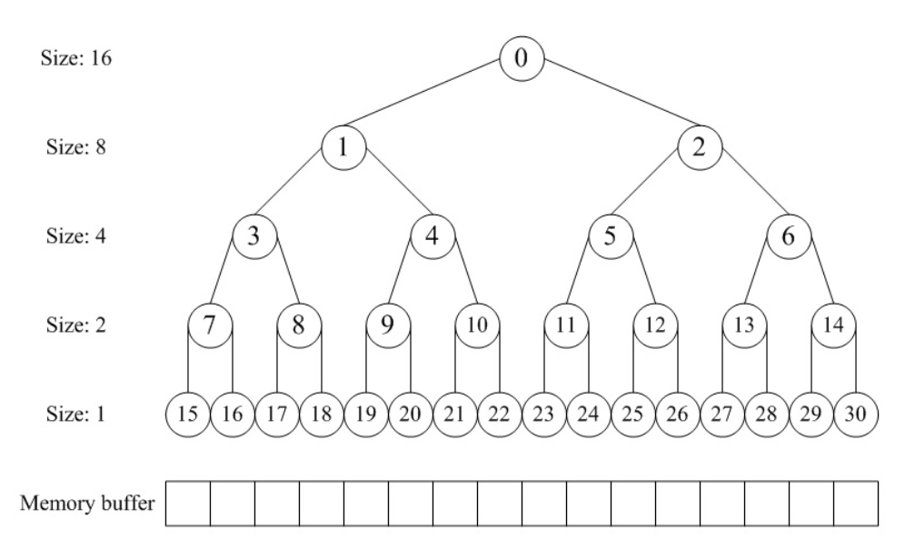
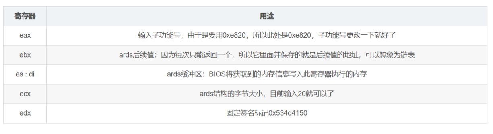
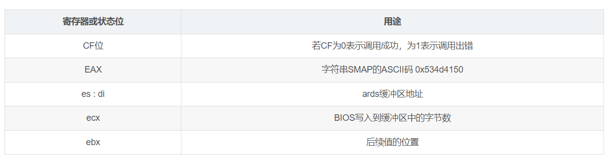
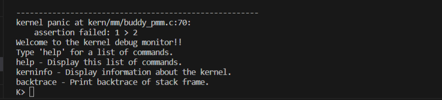
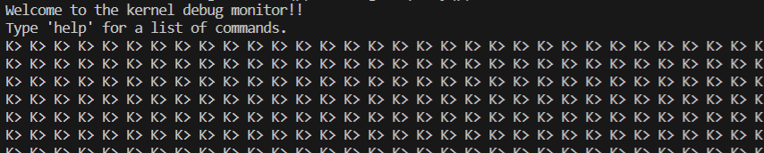
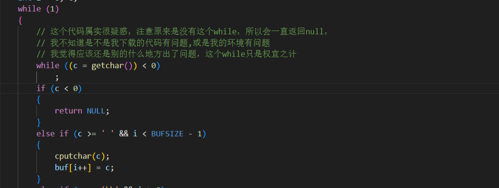

# lab2 实验报告

# 操作系统 lab2 实验报告

---

实验一过后大家做出来了一个可以启动的系统，实验二主要涉及操作系统的物理内存管理。操作系统为了使用内存，还需高效地管理内存资源。在实验二中大家会了解并且自己动手完成一个简单的物理内存管理系统。

---

## 实验目的

- 理解页表的建立和使用方法
- 理解物理内存的管理方法
- 理解页面分配算法

---

## 实验内容

实验一过后大家做出来了一个可以启动的系统，实验二主要涉及操作系统的物理内存管理。操作系统为了使用内存，还需高效地管理内存资源。本次实验我们会了解如何发现系统中的物理内存，然后学习如何建立对物理内存的初步管理，即了解连续物理内存管理，最后掌握页表相关的操作，即如何建立页表来实现虚拟内存到物理内存之间的映射，帮助我们对段页式内存管理机制有一个比较全面的了解。本次的实验主要是在实验一的基础上完成物理内存管理，并建立一个最简单的页表映射。

---

## 实验报告要求

对实验报告的要求：

- 填写各个基本练习中要求完成的报告内容
- 列出你认为本实验中重要的知识点，以及与对应的 OS 原理中的知识点，并简要说明你对二者的含义，关系，差异等方面的理解（也可能出现实验中的知识点没有对应的原理知识点）
- 列出你认为 OS 原理中很重要，但在实验中没有对应上的知识点

---

## 练习 1：理解 first-fit 连续物理内存分配算法（思考题）

first-fit 连续物理内存分配算法作为物理内存分配一个很基础的方法，需要同学们理解它的实现过程。请大家仔细阅读实验手册的教程并结合 `kern/mm/default_pmm.c` 中的相关代码，认真分析 default_init，default_init_memmap，default_alloc_pages， default_free_pages 等相关函数，并描述程序在进行物理内存分配的过程以及各个函数的作用。 请在实验报告中简要说明你的设计实现过程。请回答如下问题：

- 你的 first fit 算法是否有进一步的改进空间？

`kern/mm/default_pmm.c` 实现了 first fit 算法。让我们逐个分析相关函数，并了解它们在内存分配过程中的作用。

### 1. `default_init`:

- **目的：** 初始化空闲页链表和空闲页数量。
- **详细：**

  - 使用 `list_init` 初始化一个空链表（`free_list`）。
  - 将 `nr_free` 设置为 0。

### 2. `default_init_memmap`:

- **目的：** 用给定的参数初始化一个空闲内存块。
- **详细：**

  - 遍历指定范围内的每个页。
  - 初始化页的属性、标志和引用。
  - 将空闲块的第一页添加到 `free_list`。
  - 更新 `nr_free` 为块中的页数。

### 3. `default_alloc_pages`:

- **目的：** 使用首次适应算法分配一页内存块。
- **详细：**

  - 遍历 `free_list`，找到第一个足够大的块（至少包含 `n` 个页）。
  - 如果找到合适的块，更新页的属性并将它们从空闲链表中删除。
  - 如果块大于需求，将剩余的页重新添加到空闲链表。
  - 相应地更新 `nr_free`。

### 4. `default_free_pages`:

- **目的：** 释放一页内存块，并尝试合并相邻的空闲块。
- **详细：**

  - 重置释放的页的属性、标志和引用。
  - 按正确的顺序将页添加回空闲链表。
  - 尝试合并释放块的相邻空闲块。
  - 相应地更新 `nr_free`。

### 5. `default_nr_free_pages`:

- **目的：** 返回当前的空闲页数。
- **详细：**

  - 简单地返回 `nr_free` 的值。

### 6. `basic_check`:

- **目的：** 对分配和释放功能进行基本检查。
- **详细：**

  - 分配三页并对页的属性和引用进行基本检查。
  - 释放页并检查空闲链表是否正确更新。

### 7. `default_check`:

- **目的：** 对默认内存管理器进行高级功能检查。
- **详细：**

  - 使用 `basic_check` 进行基本检查。
  - 以各种模式分配和释放页，检查其行为是否正确。
  - 更新并验证有关空闲块的统计信息。

### 内存分配过程：

1. **初始化：**

   - 调用 `default_init` 初始化空闲链表并将 `nr_free` 设置为 0。
2. **内存映射初始化：**

   - 调用 `default_init_memmap` 初始化一个内存块，并将其添加到空闲链表。
3. **分配：**

   - 调用 `default_alloc_pages` 分配一个页块。
   - 使用首次适应算法找到空闲链表中第一个足够大的块。
   - 如果块比需要的大，拆分块并将剩余的页重新添加到空闲链表。
   - 相应地更新 `nr_free`。
4. **释放：**

   - 调用 `default_free_pages` 释放一个页块，并尝试合并相邻的空闲块。

### 潜在的改进空间：

1. **效率改进：**

   - 首次适应算法简单但可能导致碎片化。考虑更先进的算法，如 best fit 算法或 buddy system 算法，以提高空间利用率。
2. **优化合并逻辑：**

   - `default_free_pages` 中的合并逻辑可以进一步优化。可能存在连续合并的情况，以减少碎片化。
3. **提高搜索速度：**

   - `default_alloc_pages` 中的搜索是线性的。考虑优化搜索过程，可能使用更先进的数据结构来管理空闲链表。
4. **内存紧凑性：**

   - 实现逻辑以紧凑内存，通过移动已分配块以最小化碎片。

---

## 练习 2：实现 Best-Fit 连续物理内存分配算法（需要编程）

在完成练习一后，参考 kern/mm/default_pmm.c 对 First Fit 算法的实现，编程实现 Best Fit 页面分配算法，算法的时空复杂度不做要求，能通过测试即可。 请在实验报告中简要说明你的设计实现过程，阐述代码是如何对物理内存进行分配和释放，并回答如下问题：

- 你的 Best-Fit 算法是否有进一步的改进空间？

Best-Fit 算法实现涉及了以下几个函数，让我们逐一解释它们：

### 1. `best_fit_init_memmap`:

- **目的：** 用给定的参数初始化一个空闲内存块。
- **详细：**

  - 遍历指定范围内的每个页。
  - 初始化页的属性、标志和引用。
  - 将空闲块的第一页添加到 `free_list`。
  - 更新 `nr_free` 为块中的页数。
  - 将空闲块按照 Best-Fit 算法的要求插入到空闲链表中，以保持链表有序。

```c
static void
best_fit_init_memmap(struct Page *base, size_t n)
{
    assert(n > 0);
    struct Page *p = base;
    for (; p != base + n; p++)
    {
        assert(PageReserved(p));
        /*LAB2 EXERCISE 2: YOUR CODE 2112426*/
        // 清空当前页框的标志和属性信息，并将页框的引用计数设置为0
        p->flags = p->property = 0;
        set_page_ref(p, 0);
    }

    base->property = n;          // 设置基地址页的属性为总页数
    SetPageProperty(base);       // 设置基地址页为保留页
    nr_free += n;                // 增加空闲页数

    // 如果空闲页链表为空，将基地址页添加到链表
    if (list_empty(&free_list))
    {
        // cprintf("初始化时，链表为空\n");
        list_add(&free_list, &(base->page_link));
    }
    else
    {
        list_entry_t *le = &free_list;
        while ((le = list_next(le)) != &free_list)
        {
            struct Page *page = le2page(le, page_link);
            /*LAB2 EXERCISE 2: YOUR CODE 2112426*/
            // 编写代码
            // 1、当base < page时，找到第一个大于base的页，将base插入到它前面，并退出循环
            // 2、当list_next(le) == &free_list时，若已经到达链表结尾，将base插入到链表尾部
            if (base < page)
            {
                list_add_before(le, &(base->page_link));
                break;
            }
            else if (list_next(le) == &free_list)
            {
                list_add(le, &(base->page_link));
            }
        }
    }
}
```

### 2. `best_fit_alloc_pages`:

- **目的：** 使用 Best-Fit 算法分配一页或多页内存块。
- **详细：**

  - 遍历空闲链表，查找满足需求的最小连续空闲页框。
  - 如果找到满足需求的页面，记录该页面以及当前找到的最小连续空闲页框数量。
  - 如果找到适合的页面，更新页的属性，将其从空闲链表中删除，并根据需要拆分块。

```c
// 分配页函数，实现Best-Fit算法
static struct Page *
best_fit_alloc_pages(size_t n)
{
    assert(n > 0);
    // 总空间不足
    if (n > nr_free)
    {
        // cprintf("Needed Size > nr_free!\n\n");
        return NULL;
    }

    struct Page *page = NULL;
    list_entry_t *le = &free_list;
    size_t min_size = nr_free + 1;
    /*LAB2 EXERCISE 2: YOUR CODE 2112426*/
    // 下面的代码是first-fit的部分代码，请修改下面的代码改为best-fit
    // 遍历空闲链表，查找满足需求的空闲页框
    // 如果找到满足需求的页面，记录该页面以及当前找到的最小连续空闲页框数量
    while ((le = list_next(le)) != &free_list)
    {
        struct Page *p = le2page(le, page_link);
        // cprintf(" Current Block Size:%d\n", p->property);
        if (p->property >= n)
        {
            if((p->property-n) < min_size)
            {
                page = p;
                min_size = p->property-n;
                // cprintf("Find a block: size = %d\n", p->property);   
            }
        }
    }

    if (page != NULL)
    {
        // cprintf("suitable Page Success!\n");
        list_entry_t *prev = list_prev(&(page->page_link));
        list_del(&(page->page_link));
        if (page->property > n)
        {
            struct Page *p = page + n;
            p->property = page->property - n;
            SetPageProperty(p);
            list_add(prev, &(p->page_link));
        }
        nr_free -= n;
        ClearPageProperty(page);
    }
    else
    {
        // cprintf("page = NULL!\n");
    }

    return page;
}
```

### 3. `best_fit_free_pages`:

- **目的：** 释放一页或多页内存块，并尝试合并相邻的空闲块。
- **详细：**

  - 重置释放的页的属性、标志和引用。
  - 按正确的顺序将页添加回空闲链表。
  - 尝试合并释放块的相邻空闲块。

```c
static void
best_fit_free_pages(struct Page *base, size_t n)
{
    assert(n > 0);
    struct Page *p = base;

    // 遍历释放的页范围，重置页的属性
    for (; p != base + n; p++)
    {
        assert(!PageReserved(p) && !PageProperty(p));
        p->flags = 0;
        set_page_ref(p, 0);
    }
    /*LAB2 EXERCISE 2: YOUR CODE 2112426*/
    // 编写代码
    // 具体来说就是设置当前页块的属性为释放的页块数、并将当前页块标记为已分配状态、最后增加nr_free的值
    base->property = n;      // 设置基地址页的属性为释放的总页数
    SetPageProperty(base);   // 设置基地址页为保留页
    nr_free += n;            // 增加空闲页数


    if (list_empty(&free_list))
    {
        list_add(&free_list, &(base->page_link));
    }
    else
    {
        list_entry_t *le = &free_list;
        while ((le = list_next(le)) != &free_list)
        {
            struct Page *page = le2page(le, page_link);
            if (base < page)
            {
                list_add_before(le, &(base->page_link));
                break;
            }
            else if (list_next(le) == &free_list)
            {
                list_add(le, &(base->page_link));
            }
        }
    }

    // 尝试合并释放后的空闲块的低地址部分
    list_entry_t *le = list_prev(&(base->page_link));
    if (le != &free_list)
    {
        p = le2page(le, page_link);
        /*LAB2 EXERCISE 2: YOUR CODE 2112426*/
        // 编写代码
        // 1、判断前面的空闲页块是否与当前页块是连续的，如果是连续的，则将当前页块合并到前面的空闲页块中
        // 2、首先更新前一个空闲页块的大小，加上当前页块的大小
        // 3、清除当前页块的属性标记，表示不再是空闲页块
        // 4、从链表中删除当前页块
        // 5、将指针指向前一个空闲页块，以便继续检查合并后的连续空闲页块
        if (p + p->property == base)
        {
            p->property += base->property;
            ClearPageProperty(base);
            list_del(&(base->page_link));
            base = p;
        }
    }

    // 尝试合并释放后的空闲块的高地址部分
    le = list_next(&(base->page_link));
    if (le != &free_list)
    {
        p = le2page(le, page_link);
        if (base + base->property == p)
        {
            base->property += p->property;
            ClearPageProperty(p);
            list_del(&(p->page_link));
        }
    }
}
```

### 改进空间：

1. **优化遍历算法：**

   - 在 `best_fit_alloc_pages` 中，你使用了线性搜索来找到适合的页面。考虑使用更高效的数据结构，如二叉堆或红黑树，以提高搜索速度。
2. **减少搜索次数：**

   - 在 `best_fit_alloc_pages` 中，可以考虑记录上一次找到的合适页面的位置，以减少搜索次数。
3. **内存紧凑性：**

   - 实现逻辑以紧凑内存，通过移动已分配块以最小化碎片。

---

## 扩展练习 Challenge：buddy system（伙伴系统）分配算法（需要编程）

Buddy System 算法把系统中的可用存储空间划分为存储块(Block)来进行管理, 每个存储块的大小必须是 2 的 n 次幂(Pow(2, n)), 即 1, 2, 4, 8, 16, 32, 64, 128...

- 参考[伙伴分配器的一个极简实现](http://coolshell.cn/articles/10427.html)， 在 ucore 中实现 buddy system 分配算法，要求有比较充分的测试用例说明实现的正确性，需要有设计文档。

Buddy system 是一种连续物理内存的分配算法，主要应用二叉树来完成内存的分配；可以用来替换 exe1 中的 first-fit 算法。

网上对 buddy system 的算法定义如下：

**分配内存：**

1.寻找大小合适的内存块（大于等于所需大小并且最接近 2 的幂，比如需要 27，实际分配 32）

1.1 如果找到了，分配给应用程序。
1.2 如果没找到，分出合适的内存块。

1.2.1 对半分离出高于所需大小的空闲内存块
1.2.2 如果分到最低限度，分配这个大小。
1.2.3 回溯到步骤 1（寻找合适大小的块）
1.2.4 重复该步骤直到一个合适的块

**释放内存：**

1.释放该内存块

1.1 寻找相邻的块，看其是否释放了。
1.2 如果相邻块也释放了，合并这两个块，重复上述步骤直到遇上未释放的相邻块，或者达到最高上限（即所有内存都释放了）。

在此定义之下，我们使用数组分配器来模拟构建这样完全二叉树结构而不是真的用指针建立树结构——树结构中向上或向下的指针索引都通过数组分配器里面的下标偏移来实现。在这个“完全二叉树”结构中，二叉树的节点用于标记相应内存块的使用状态，高层节点对应大的块，低层节点对应小的块，在分配和释放中我们就通过这些节点的标记属性来进行块的分离合并。

在分配阶段，首先要搜索大小适配的块——这个块所表示的内存大小刚好大于等于最接近所需内存的 2 次幂；通过对树深度遍历，从左右子树里面找到最合适的，将内存分配。

在释放阶段，我们将之前分配出去的内存占有情况还原，并考察能否和同一父节点下的另一节点合并，而后递归合并，直至不能合并为止。



基于上面的理论准备，我们可以开始写代码了。因为 buddy system 替代的是之前的 first fit 算法，所以可以仿照 default_pmm 的格式来写。

首先，编写 buddy.h（仿照 default_pmm.h），唯一修改的地方是引入的 pmm_manager 不一样，要改成 buddy system 所使用的 buddy_pmm_manager

```c
#ifndef __KERN_MM_BUDDY_PMM_H__
#define  __KERN_MM_BUDDY_PMM_H__

#include <pmm.h>

extern const struct pmm_manager buddy_pmm_manager;

#endif /* ! __KERN_MM_BUDDY_PMM_H__ */
```

而后，进入 buddy.c 文件

1. 因为这里使用数组来表示二叉树结构，所以需要建立正确的索引机制：每 level 的第一左子树的下标为 2^level-1，所以如果我们得到[index]节点的所在 level，那么 offset 的计算可以归结为(index-2^level+1) * node_size = (index+1)_node_size – node_size_2^level。其中 size 的计算为 2^(max_depth-level)，所以 node_size * 2^level = 2^max_depth = size。综上所述，可得公式 offset=(index+1)*node_size – size。
   PS：式中索引的下标均从 0 开始，size 为内存总大小，node_size 为内存块对应大小。
2. 由上，完成宏定义。

```c
// 来自参考链接的一些宏定义
#define LEFT_LEAF(index) ((index) * 2 + 1)
#define RIGHT_LEAF(index) ((index) * 2 + 2)
#define PARENT(index) (((index) + 1) / 2 - 1)
```

1. 因为 buddy system 的块大小都是 2 的倍数，所以我们对于输入的所需的块大小，要先计算出最接近于它的 2 的倍数的值以匹配 buddy system 的最合适块的查找。

```c
static unsigned fixsize(unsigned size) 
{
  size |= size >> 1;
  size |= size >> 2;
  size |= size >> 4;
  size |= size >> 8;
  size |= size >> 16;
  return size+1;
}
```

1. 构造 buddy system 最基本的数据结构，并初始化一个用来存放二叉树的数组。

```c
struct buddy2
{
    unsigned size;    // 管理总内存的大小
    unsigned longest; // 其两个子节点中最大的连续空间大小
};
// 存放二叉树的数组，用于内存分配，大小为需要管理的叶节点的两倍
struct buddy2 root[10000];
```

1. buddy system 是需要和实际指向空闲块双链表配合使用的，所以需要先各自初始化数组和指向空闲块的双链表。

```c
// 先初始化双链表
free_area_t free_area;
#define free_list (free_area.free_list)
#define nr_free (free_area.nr_free)

// 再初始化buddy system的数组
void buddy_new(int size)
{
    unsigned node_size; // 传入的size是这个buddy system表示的总空闲空间；node_size是对应节点所表示的空闲空间的块数
    int i;
    nr_block = 0;
    if (size < 1 || !IS_POWER_OF_2(size))
        return;

    root[0].size = size;
    node_size = size * 2; // 认为总结点数是size*2

    for (i = 0; i < 2 * size - 1; ++i)
    {
        if (IS_POWER_OF_2(i + 1)) // 如果i+1是2的倍数，那么该节点所表示的二叉树就要到下一层了
            node_size /= 2;
        root[i].longest = node_size; // longest是该节点所表示的初始空闲空间块数
    }
    return;
}
```

1. 根据 pmm.h 里面对于 pmm_manager 的统一结构化定义，我们需要对 buddy system 完成如下函数：

```c
const struct pmm_manager buddy_pmm_manager = {
    .name = "buddy_pmm_manager",      // 管理器的名称
    .init = buddy_init,               // 初始化管理器
    .init_memmap = buddy_init_memmap, // 设置可管理的内存,初始化可分配的物理内存空间
    .alloc_pages = buddy_alloc_pages, // 分配>=N个连续物理页,返回分配块首地址指针 
    .free_pages = buddy_free_pages,   // 释放包括自Base基址在内的，起始的>=N个连续物理内存页
    .nr_free_pages = buddy_nr_free_pages, // 返回全局的空闲物理页数量
    .check = buddy_check,             //举例检测这个pmm_manager的正确性
};
```

5.1 初始化管理器（这个已在上面完成）

5.2 初始化可管理的物理内存空间

```c
// 初始化内存映射关系
// 添加每一页到 free_list中
static void
buddy_init_memmap(struct Page *base, size_t n)
{
    assert(n > 0);
    struct Page *p = base;
    for (; p != base + n; p++)
    {
        assert(PageReserved(p));
        p->flags = 0;
        p->property = 1;
        set_page_ref(p, 0); // 表明空闲可用
        SetPageProperty(p);
        // 向双链表中加入页的管理部分
        list_add_before(&free_list, &(p->page_link));
    }
    nr_free += n;
    int allocpages = UINT32_ROUND_DOWN(n);
    // 初始化二叉树
    // 传入所需要表示的总内存页大小，让buddy system的数组得以初始化
    buddy_new(allocpages);
}
```

5.3 分配所需的物理页，返回分配块首地址指针

```c
// 内存分配
// 二叉树中找到一个合适的块，将其标记为已使用，并返回偏移量。
// 分配的逻辑是：首先在buddy的“二叉树”结构中找到应该分配的物理页在整个实际双向链表中的位置
// 而后把相应的page进行标识表明该物理页已经分出去了
int buddy2_alloc(struct buddy2 *self, int size)
{                       // size就是这次要分配的物理页大小
    unsigned index = 0; // 节点的标号
    unsigned node_size; // 用于后续循环寻找合适的节点
    unsigned offset = 0;

    if (self == NULL) // 无法分配
        return -1;

    if (size <= 0) // 分配不合理
        size = 1;
    else if (!IS_POWER_OF_2(size)) // 不为2的幂时，取比size更大的2的n次幂
        size = fixsize(size);

    if (self[index].longest < size) // 根据根节点的longest，发现可分配内存不足，也返回
        return -1;

    // 从根节点开始，向下寻找左右子树里面找到最合适的节点
    for (node_size = self->size; node_size != size; node_size /= 2)
    {
        if (self[LEFT_LEAF(index)].longest >= size)
        {
            if (self[RIGHT_LEAF(index)].longest >= size)
            {
                index = self[LEFT_LEAF(index)].longest <= self[RIGHT_LEAF(index)].longest ? LEFT_LEAF(index) : RIGHT_LEAF(index);
                // 找到两个相符合的节点中内存较小的结点
            }
            else
            {
                index = LEFT_LEAF(index);
            }
        }
        else
            index = RIGHT_LEAF(index);
    }

    self[index].longest = 0;                       // 标记节点为已使用
    offset = (index + 1) * node_size - self->size; // offset得到的是该物理页在双向链表中距离“根节点”的偏移
    // 这个节点被标记使用后，要层层向上回溯，改变父节点的longest值
    while (index)
    {
        index = PARENT(index);
        self[index].longest =
            MAX(self[LEFT_LEAF(index)].longest, self[RIGHT_LEAF(index)].longest);
    }
    return offset;
}

// 对 alloc_pages 的一个封装
// 调用 buddy2_alloc 分配内存块，并更新相应的信息
// 分配的逻辑是：首先在buddy的“二叉树”结构中找到应该分配的物理页在整个实际双向链表中的位置，而后把相应的page进行标识表明该物理页已经分出去了。
static struct Page *
buddy_alloc_pages(size_t n)
{
    assert(n > 0);
    if (n > nr_free)
        return NULL;

    struct Page *page = NULL;
    struct Page *p;
    list_entry_t *le = &free_list, *len;
    rec[nr_block].offset = buddy2_alloc(root, n); // 记录偏移量

    // 找到分配的块的base
    int i;
    for (i = 0; i < rec[nr_block].offset + 1; i++)
        le = list_next(le);
    page = le2page(le, page_link);

    int allocpages = n;
    if (!IS_POWER_OF_2(n))
        allocpages = fixsize(n);

    // 根据需求n得到块大小
    rec[nr_block].base = page;     // 记录分配块首页
    rec[nr_block].nr = allocpages; // 记录分配的页数
    nr_block++;

    for (i = 0; i < allocpages; i++)
    {
        len = list_next(le);
        p = le2page(le, page_link);
        ClearPageProperty(p);
        le = len;
    }                      // 修改每一页的状态
    nr_free -= allocpages; // 减去已被分配的页数
    page->property = n;
    return page;
}
```

5.4 释放指定的内存页大小

```c
// 释放内存
// 将被释放的内存块重新加入到 free_list 中，并更新伙伴系统的信息。
void buddy_free_pages(struct Page *base, size_t n)
{
    unsigned node_size, index = 0;
    unsigned left_longest, right_longest;
    struct buddy2 *self = root;

    list_entry_t *le = list_next(&free_list);
    int i = 0;
    for (i = 0; i < nr_block; i++) // nr_block是已分配的块数
    {
        if (rec[i].base == base)
            break;
    } // 找到释放块的偏移量
    int offset = rec[i].offset;
    int pos = i; // 暂存i

    i = 0;
    while (i < offset)
    {
        le = list_next(le);
        i++; // 根据该分配块的记录信息，可以找到双链表中对应的page
    }        // 在页链表中找到对应页

    int allocpages = n;
    if (!IS_POWER_OF_2(n))
        allocpages = fixsize(n);

    assert(self && offset >= 0 && offset < self->size); // 是否合法
    nr_free += allocpages;                              // 更新空闲页的数量
    struct Page *p;
    for (i = 0; i < allocpages; i++) // 遍历页链表，回收已分配的页
    {
        p = le2page(le, page_link);
        p->flags = 0;
        p->property = 1;
        
        SetPageProperty(p);
        le = list_next(le);
    }

    // 实际的双链表信息复原后，还要对二叉树里面的节点信息进行更新
    node_size = 1;
    index = offset + self->size - 1; // 从原始的分配节点的最底节点开始改变longest
    for (; self[index].longest; index = PARENT(index))
    {
        node_size *= 2;
        if (index == 0)
            return;
    }//先找到要复原对应的buddy

    self[index].longest = node_size; // 这里应该是node_size，也就是从1那层开始改变
    while (index)
    { // 向上合并，修改父节点的记录值
        index = PARENT(index);
        node_size *= 2;
        left_longest = self[LEFT_LEAF(index)].longest;
        right_longest = self[RIGHT_LEAF(index)].longest;

        if (left_longest + right_longest == node_size)
            self[index].longest = node_size;
        else
            self[index].longest = MAX(left_longest, right_longest);
    }

    for (i = pos; i < nr_block - 1; i++) // 清除此次的分配记录，即从分配数组里面把后面的数据往前挪
    {
        rec[i] = rec[i + 1];
    }
    nr_block--; // 更新分配块数的值
}
```

5.5 返回全局的空闲物理页数

```c
// 返回当前可用的空闲页数
static size_t
buddy_nr_free_pages(void)
{
    return nr_free;
}
```

5.6 检查这个 pmm_manager 是否正确（参考链接）

```c
static void
buddy_check(void) {
    cprintf("=============Stage 1============\n");
    struct Page *p0, *A, *B,*C,*D;
    p0 = A = B = C = D =NULL;
    
    assert((p0 = alloc_page()) != NULL);
    assert((A = alloc_page()) != NULL);
    assert((B = alloc_page()) != NULL);

    assert(p0 != A && p0 != B && A != B);
    assert(page_ref(p0) == 0 && page_ref(A) == 0 && page_ref(B) == 0);
    free_page(p0);
    free_page(A);
    free_page(B);
    
    
    cprintf("=============Stage 2============\n");
    A=alloc_pages(500);
    B=alloc_pages(500);
    cprintf("A %p\n",A);
    cprintf("B %p\n",B);
    free_pages(A,250);
    free_pages(B,500);
    free_pages(A+250,250);
    A=alloc_pages(500);
    cprintf("A %p\n",A);
    free_pages(A,500);
    
    
    cprintf("=============Stage 3============\n");
    //以下是根据链接中的样例测试编写的
    A=alloc_pages(65);  
    B=alloc_pages(33);
    assert(A+128==B);//检查是否相邻
    cprintf("A %p\n",A);
    cprintf("B %p\n",B);
    

    cprintf("=============Stage 4============\n");
    C=alloc_pages(80);
    assert(A+256==C);//检查C有没有和A重叠
    cprintf("C %p\n",C);
    free_pages(A,70);//释放A
    cprintf("B %p\n",B);
    D=alloc_pages(60);
    cprintf("D %p\n",D);
    assert(B+64==D);//检查B，D是否相邻
    free_pages(B,35);
    cprintf("D %p\n",D);
    free_pages(D,60);
    cprintf("C %p\n",C);
    free_pages(C,80);
    free_pages(p0,1000);//全部释放
}
```

---

---

## 扩展练习 Challenge：任意大小的内存单元 slub 分配算法（需要编程）

slub 算法，实现两层架构的高效内存单元分配，第一层是基于页大小的内存分配，第二层是在第一层基础上实现基于任意大小的内存分配。可简化实现，能够体现其主体思想即可。

- 参考 [linux 的 slub 分配算法/](http://www.ibm.com/developerworks/cn/linux/l-cn-slub/)，在 ucore 中实现 slub 分配算法。要求有比较充分的测试用例说明实现的正确性，需要有设计文档。

---

## 扩展练习 Challenge：硬件的可用物理内存范围的获取方法（思考题）

- 如果 OS 无法提前知道当前硬件的可用物理内存范围，请问你有何办法让 OS 获取可用物理内存范围？

在进行思考之前我们有一些想法，最朴素的想法就是尝试遍历申请所有的内存地址了，这样就可以通过申请结果确定内存的状态了。
还有一种想法是，既然无法提前知道，那就只能当场获取了。操作系统唯一能够依靠的就只有固件了，并没有指定是 ucore，所以不一定得是 opensbi,所以尝试对 linux 使用 bios 获取地址。

### 1.通过 bios

在 x86 体系下，由三种方法可以查看系统的内存，但是其本质都是依托 BIOS 的 `0x15` 中断的三个子功能：

- **eax = 0xe820**：遍历主机上全部内存
- **ax = 0xe801**：分别检测低 15MB 和 16MB~4GB 的内存
- **ah = 0x88**：最多检测出 64MB 内存

#### 0xe820：遍历主机上全部内存

BIOS 中断 0x15 的子功能号 `0xe820` 能够获取系统的内存布局，由于系统内存各部分的类型属性不同，BIOS 就按照类型属性来划分这片系统内存，BIOS 不断的将内存信息返回。这个返回的本质起始时一个**地址范围描述符**，其结构如下：


其中每个字段的含义如下：

- **BaseAddrLow**：基地址的低 32 位
- **BaseAddrHigh**：基地址的高 32 位
- **LengthLow**：内存长度低 32 位
- **LengthHigh**：内存长度高 32 位
- **Type**：本段内存的属性

调用前的输入需要满足



主要步骤

- 填写好输入的寄存器
- 执行中断
- 在 CF 位为 0 的情况下，获取相应的结果

返回规则如下



#### 0xe801 分别检测低 15MB 和 16MB~4GB 的内存

这也是 0xe820 失败后我们应该采取的第一个补救措施。

为什么他不是我们获取内存信息的首要方法呢？这是因为其检测到的内存是分别存放到两组寄存器中的。低于 15MB 的内存以 1KB 为单位大小来记录，单位数量在寄存器 ax 和 cx 中记录，当然，这两个值一样的。16MB~4GB 是以 64KB 为单位大小来记录的，单位数量在寄存器 bx 和 dx 中记录。

调用前输入满足


返回规则


#### **ah = 0x88**：检测 64MB 内存

这个方法是功能性最局限的

输入


输出


### 2.不通过 bios,自己去查

检查的方法也很简单，从一个地址开始，每次增加 4K，然后往里面赋一个值，对其操作一下，例如反转，然后查看操作能否成功，即可判断是否可用。

> 首先要让 cache 无效，因为 cache 会存储我们最近访问的内存，影响检查过程。因此先查查 CPU 是不是在 486 以上，如果是，就将缓存设为 OFF。    //30 天自制操作系统 书中这么说，我觉得没必要。

**具体做法**

> 对 EFLAGS 进行处理，检查 CPU 是 486 以 上还是 386。如果是 486 以上，为了禁止缓存，需要对 CR0 寄存器的某一标志位进行操作。

这部分需要用汇编实现

然后就可以写一段 c 代码，编译，要求必须是 0 优化，因为在编译器看来我们做这些是脑残行为，会都给我们优化掉。也可以直接写汇编代码。

```c
unsigned int memtest_sub(unsigned int start, unsigned int end)
{
    unsigned int i,
        *p, old, pat0 = 0xaa55aa55, pat1 = 0x55aa55aa;
    for (i = start; i <= end; i += 0x1000)
    {
        p = (unsigned int *)(i + 0xffc);
        old = *p;         /* 先记住修改前的值 */
        *p = pat0;        /* 试写 */
        *p ^= 0xffffffff; /* 反转 */
        if (*p != pat1)
        { /* 检查反转结果 */
        not_memory:
            *p = old;
            break;
        }
        *p ^= 0xffffffff; /* 再次反转 */
        if (*p != pat0)
        { /* 检查值是否恢复 */
            goto not_memory;
        }
        *p = old; /* 恢复为修改前的值 */
    }
    return i;
}
```

参考

[30 天自制操作系统](https://github.com/oddman2017/haribote/blob/master/30%E5%A4%A9%E8%87%AA%E5%88%B6%E6%93%8D%E4%BD%9C%E7%B3%BB%E7%BB%9F.(%E5%B7%9D%E5%90%88%E7%A7%80%E5%AE%9E).%E5%91%A8%E8%87%AA%E6%81%92%E7%AD%89.%E6%89%AB%E6%8F%8F%E7%89%88.pdf) 第 9 天

[Gos —— 获取物理内存容量_x86 获取内存大小-CSDN 博客](https://blog.csdn.net/shenmingxueIT/article/details/120844724)

## 额外知识点

1.在进行实验时，如果进入 assert 函数判断条件错误，就会进入 kernel debug monitor。原本 ucore 的设计是会给出几个调试命令，可以通过不同命令查看相关信息。



但是在多数同学的环境中，由于某种未知原因（如果不是 ucore 自己的 bug 的话），都出现了无限循环的输出 K> 的情况。



bug 简单修复方法是在 lab2/libs/readline.c 中的 readline 函数中过滤掉 getchar()小于 0 的情况。因为 getchar()会一直返回小于 0 的值，所以 readline 就会一直返回 NULL 而陷入输出 K> 的循环。



---
